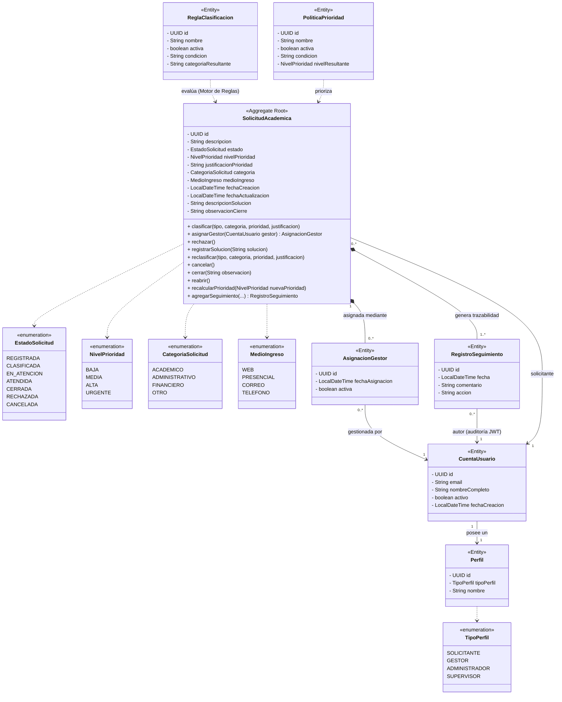

# Diagrama de Clases UML - Modelo de Dominio

Este diagrama visualiza la estructura principal de la arquitectura de dominio del **Sistema Integral de Gestión de Solicitudes Académicas**. Refleja el lenguaje ubicuo correcto (evitando el término obsoleto "Caso") y centraliza la máquina de estados en el aggregate root `SolicitudAcademica`.

## Beneficios de este Diseño para el Hito 2
1. **Lógica de Estado Centralizada:** Evita la propagación de validaciones. `SolicitudAcademica` defiende su regla de vida (Solo se puede cerrar si está en `ATENDIDA`).
2. **Alta Cohesión, Bajo Acoplamiento:** Dependencia con el módulo de toma de decisiones externalizado para soportar políticas editadas e independencia de IA.
3. **Auditoría Inquebrantable:** El agregado fuerza a que *cada* transición (sea clasificar, atender o cerrar) retorne/genere obligatoriamente un `RegistroSeguimiento` con la fecha en milisegundos, blindando la trazabilidad exigida por un Sistema de Gestión Académico.
